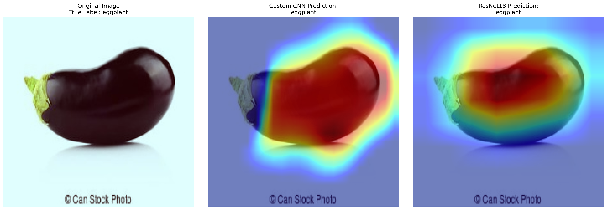

# Comparative Analysis of CNNs for Vegetable Classification using Grad-CAM

This project implements and evaluates two distinct Convolutional Neural Network (CNN) architectures for classifying images of vegetables (cucumbers, eggplants, and mushrooms). The primary goal is to compare the performance and interpretability of a custom-built CNN against a state-of-the-art ResNet18 model using transfer learning.

The analysis culminates in using **Grad-CAM (Gradient-weighted Class Activation Mapping)** to visualize and understand the internal decision-making processes of each model, providing insight into *why* one model outperforms the other.



## Key Features & Skills Demonstrated

- **Custom CNN from Scratch:** A sequential CNN was designed and implemented from the ground up to establish a performance baseline, demonstrating a strong understanding of foundational deep learning principles.

- **Transfer Learning:** A pre-trained ResNet18 model was skillfully fine-tuned on the dataset, showcasing the ability to leverage state-of-the-art architectures for high performance.

- **Model Interpretability (XAI):** Grad-CAM was implemented to generate heatmaps, visualizing the regions of an image that are most important for a model's prediction.

- **Quantitative & Qualitative Analysis:** The models were rigorously compared not only on performance metrics (Accuracy, Loss) but also on the quality and precision of their feature localization via the generated heatmaps.

- **End-to-End Workflow:** The project covers the complete machine learning pipeline: data loading and augmentation, model definition, training and validation loops, evaluation, and advanced analysis.

## Conclusion and Key Findings

> I began by constructing a **custom, sequential CNN from scratch** to establish a performance baseline. This model follows a classic architecture, which allowed me to demonstrate foundational principles. I then compared this baseline against a **pre-trained ResNet18**, leveraging transfer learning to show how modern architectures can achieve higher performance and more precise feature localization, as validated by my Grad-CAM analysis.

The results clearly demonstrate the power of transfer learning. While the custom CNN achieved a respectable accuracy, the fine-tuned ResNet18 model not only performed significantly better quantitatively but also produced far more precise and meaningful Grad-CAM heatmaps. The ResNet18 model focused on complex, high-level features (like texture and the junction of the stem), whereas the custom CNN focused on simpler, low-level features (like color and basic shape), proving the value of pre-trained weights for achieving robust and intelligent model behavior.

## Technologies Used

- **Programming Language:** Python
- **Deep Learning Framework:** PyTorch
- **Libraries:**
  - OpenCV: For image processing.
  - Albumentations: For efficient and powerful data augmentation.
  - Scikit-learn: For data splitting and evaluation metrics.
  - Pandas: For data manipulation.
  - Matplotlib & Seaborn: For data visualization.
  - NumPy: For numerical operations.

## How to Run This Project

### 1. Prerequisites

Make sure you have Python 3.8+ and `pip` installed.

### 2. Clone the Repository

```
git clone https://github.com/alanspace/Interpretability-in-Deep-Learning-A-Grad-CAM-Analysis-of-CNNs.git
cd Interpretability-in-Deep-Learning-A-Grad-CAM-Analysis-of-CNNs
```

## Set Up the Dataset

```
.
├── GradCAM-Dataset/
│   ├── train.csv
│   ├── train_images/
│   └── ...
├── Deep_Learning_with_PyTorch_GradCAM.ipynb
└── README.md
```
### 4. Install Dependencies
Install the required libraries from requirements.txt.

```
pip install -r requirements.txt
```

### 5. Run the Jupyter Notebook
Launch Jupyter Notebook or JupyterLab and open the Deep_Learning_with_PyTorch_GradCAM.ipynb file.

```
jupyter notebook
```

You can then run the cells sequentially to reproduce the training, evaluation, and analysis.

