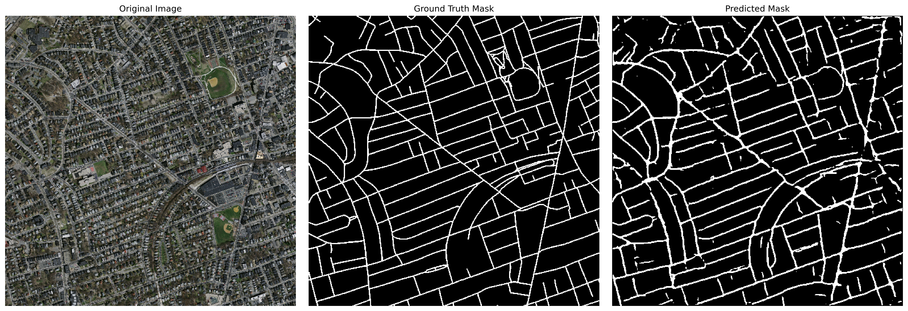

# Road Segmentation with U-Net and PyTorch

This repository contains a PyTorch implementation of a U-Net based model for semantic segmentation of roads from high-resolution aerial imagery. The project leverages the `segmentation-models-pytorch` library for a robust implementation and `albumentations` for efficient data augmentation.

The model is trained on a subset of the Massachusetts Roads Dataset.

## Demo

Here is an example of the model's performance on an image from the validation set:


<!-- | Original Image | Ground Truth Mask | Model's Prediction |
| :---: | :---: | :---: |
|  |  |  | -->

## Features

- **Model**: U-Net architecture with a pre-trained `timm-efficientnet-b0` encoder.
- **Framework**: PyTorch.
- **Loss Function**: A combination of Dice Loss and Binary Cross-Entropy with Logits Loss, effective for segmentation tasks.
- **Data Augmentation**: On-the-fly data augmentation using the `albumentations` library (Horizontal and Vertical Flips).
- **Data Handling**: A custom PyTorch `Dataset` class for easy data loading and preprocessing.
- **Training**: A complete training and validation pipeline with progress bars via `tqdm`.
- **Inference**: A clear example of how to load the trained model and perform inference on a single image.

## Dataset
This project uses a subset of the **Massachusetts Roads Dataset**. The original dataset was introduced by Volodymyr Mnih in his PhD thesis.

- **Content**: The subset contains 200 aerial images (1500x1500 pixels) and their corresponding binary road masks.
- **Source**: The data is cloned directly from this [GitHub repository](https://github.com/parth1620/Road_seg_dataset).

If you use this dataset in your research, please cite the original work:

```bibtex
@phdthesis{MnihThesis,
  author = {Volodymyr Mnih},
  title = {Machine Learning for Aerial Image Labeling},
  school = {University of Toronto},
  year = {2013}
}
```
## Setup and Installation
Follow these steps to set up the project environment.

1. Clone the repository:

```
git clone https://github.com/alanspace/Road-Segmentation-with-U-Net-and-PyTorch.git
cd Road-Segmentation-with-U-Net-and-PyTorch
```
2. Create a virtual environment (recommended):

```
python -m venv venv
source venv/bin/activate  # On Windows, use `venv\Scripts\activate`
```

3. Install the required dependencies:
A requirements.txt file is provided for easy installation.

```
pip install -r requirements.txt
```

4. Download the dataset:
The Jupyter Notebook includes a cell to clone the dataset repository. Alternatively, you can run this command in your terminal:

```
git clone https://github.com/parth1620/Road_seg_dataset.git
```

## Usage
The entire workflow is contained within the Aerial_Image_Segmentation_PyTorch.ipynb Jupyter Notebook.

1. Launch Jupyter Notebook or Jupyter Lab:
```
jupyter notebook
```
or
```
jupyter lab
```

2. Open the Notebook:
Navigate to and open the Aerial_Image_Segmentation_PyTorch.ipynb file.

3. Run the Cells:
Execute the cells in order from top to bottom. The notebook is structured as follows:

- Setup and Configuration: Imports libraries, sets up the device (GPU/CPU), and defines hyperparameters.
- Data Loading and Exploration: Loads the dataset and visualizes a sample.
- Augmentation and DataLoaders: Defines the augmentation pipeline and prepares data loaders for training.
- Model Definition: Defines the U-Net model using segmentation-models-pytorch.
- Training: Runs the training and validation loop, saving the best model weights to best_model.pth.
- Inference: Loads the saved model and visualizes its prediction on a validation image.

The best performing model will be saved as best_model.pth in the root directory.

### Model Architecture
The model is a U-Net, a convolutional neural network architecture designed for fast and precise image segmentation.

- Encoder: We use timm-efficientnet-b0 as the encoder backbone, pre-trained on the ImageNet dataset. This allows the model to leverage powerful, pre-learned features, leading to faster convergence and better performance.
- Decoder: The decoder part of the U-Net upsamples the feature maps and uses skip connections from the encoder to recover spatial information, which is crucial for precise segmentation.
- Output: The model outputs a single-channel image (logit map), to which a sigmoid function is applied to get a probability map for the road class.

### License
This project is licensed under the MIT License. See the LICENSE file for details.